# Arquitectura del Sistema NIDIA Flow

Este documento describe en detalle la arquitectura técnica del sistema NIDIA Flow.

## Diagrama de Arquitectura de Alto Nivel

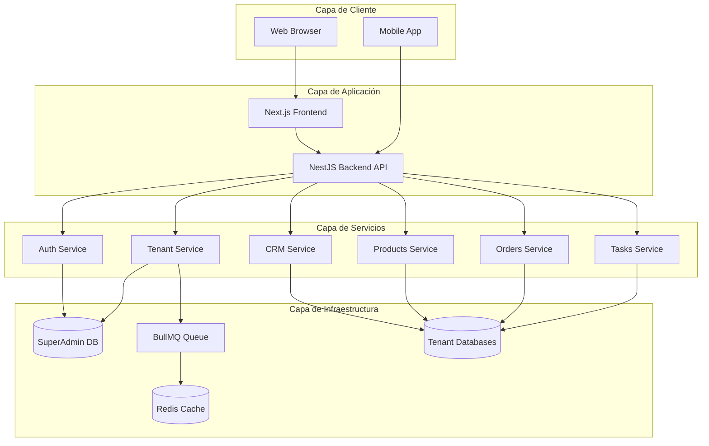

## Arquitectura Multi-Tenant

### Modelo Database-per-Tenant

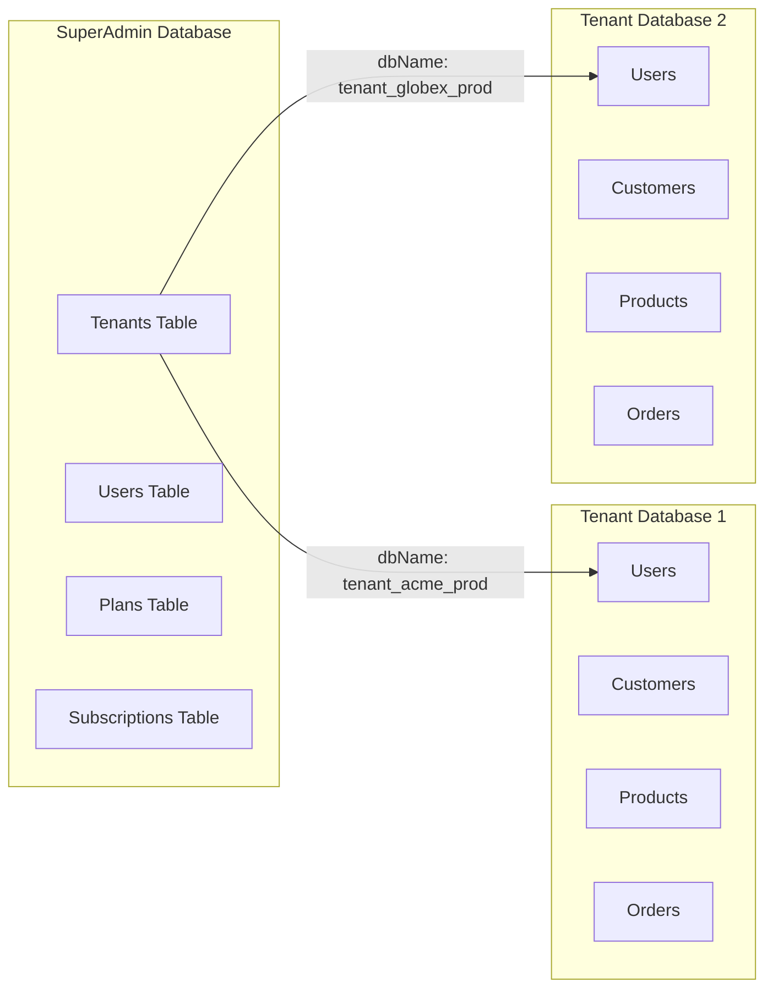

### Flujo de Conexión a Base de Datos

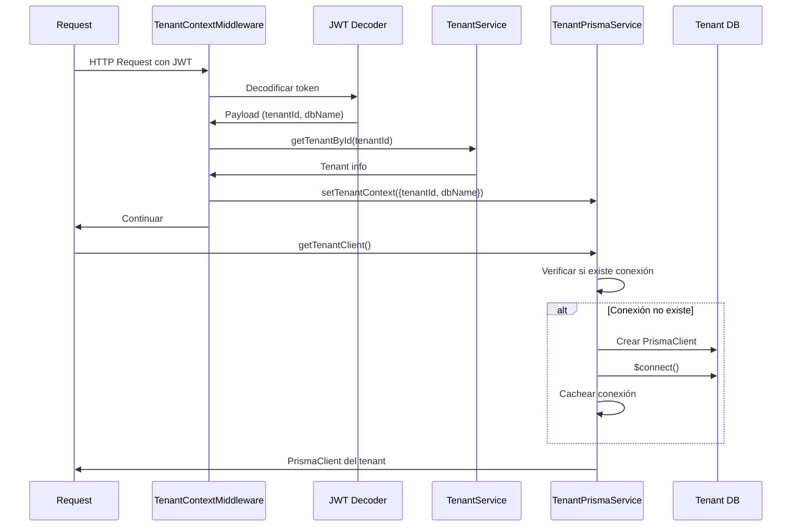

## Diagrama de Clases Principal

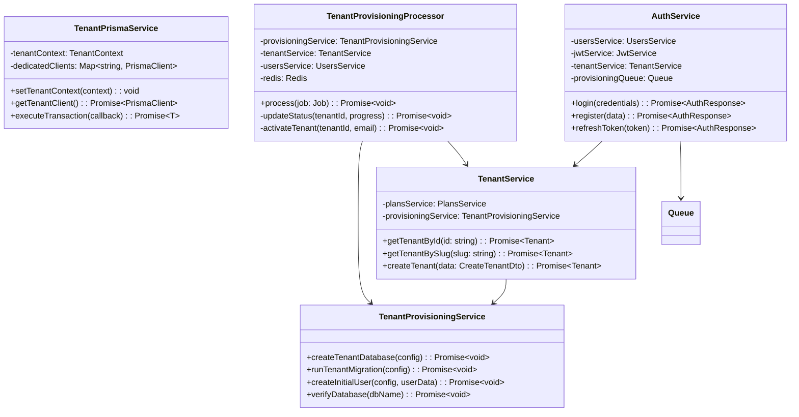

## Diagrama de Secuencia de Provisioning

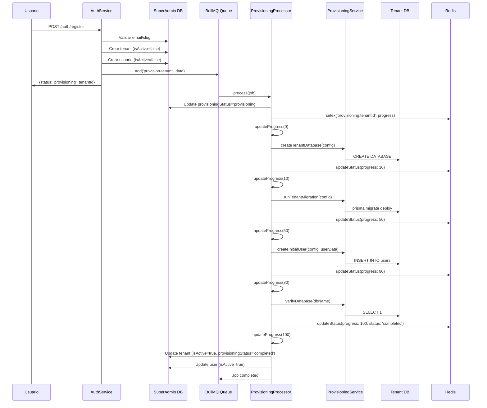

## Diagrama de Estados del Tenant

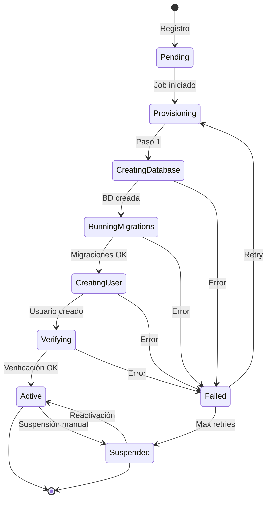

## Diagrama de Componentes de Módulos

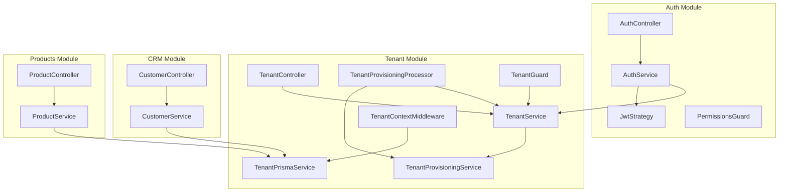

## Flujo de Datos en Request

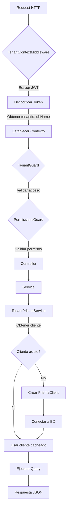

## Modelo de Datos SuperAdmin

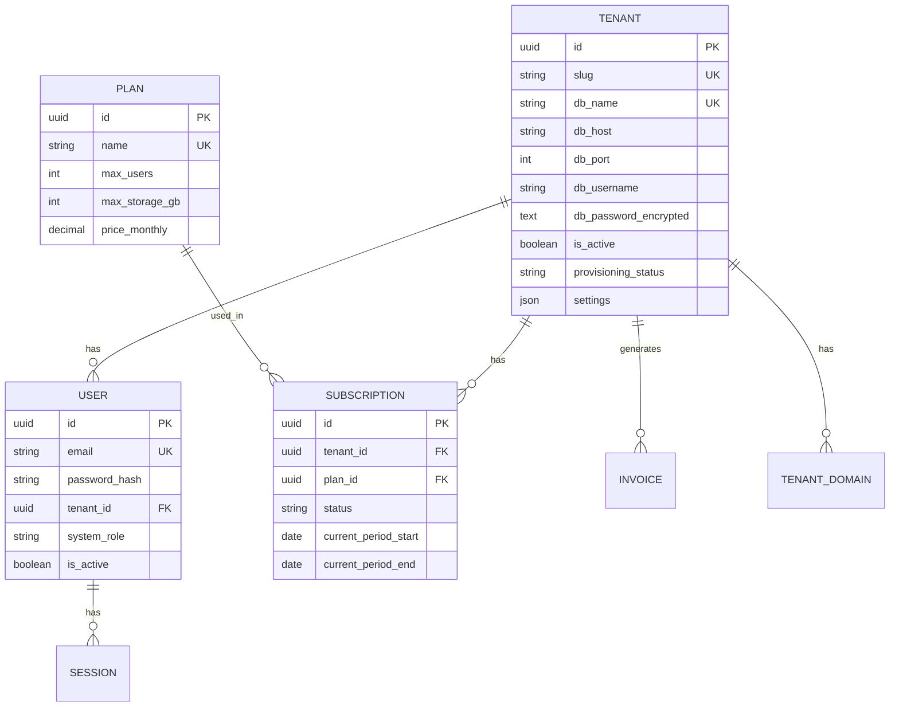

## Modelo de Datos Tenant

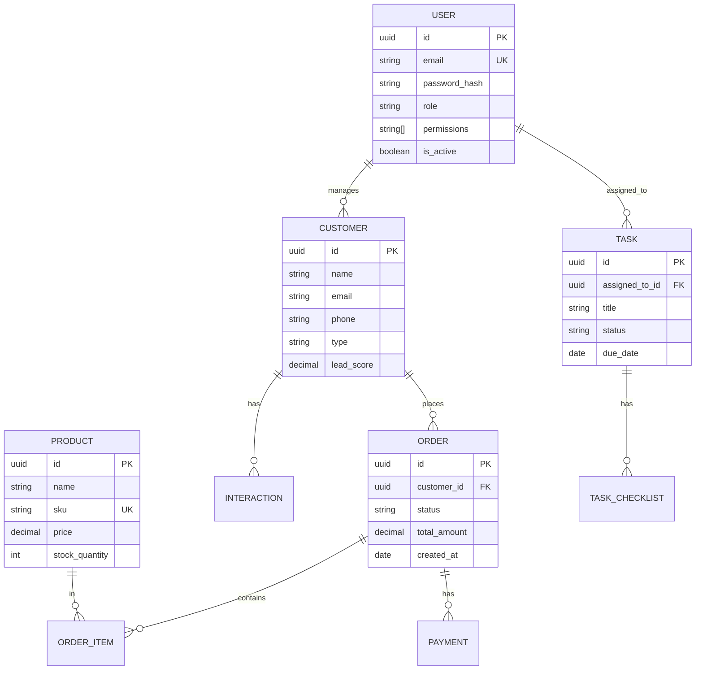

## Patrones de Diseño Utilizados

### Singleton Pattern
- `TenantPrismaService`: Gestiona conexiones Prisma por tenant
- `Prisma Client`: Instancias únicas por base de datos

### Factory Pattern
- `TenantProvisioningService`: Crea bases de datos y configuraciones
- `TenantPrismaService`: Crea instancias de PrismaClient

### Strategy Pattern
- `JwtStrategy`: Estrategia de autenticación JWT
- `LocalStrategy`: Estrategia de autenticación local

### Middleware Pattern
- `TenantContextMiddleware`: Establece contexto de tenant
- `TenantConnectionMiddleware`: Gestiona conexiones

### Guard Pattern
- `TenantGuard`: Valida acceso a tenant
- `PermissionsGuard`: Valida permisos
- `RolesGuard`: Valida roles

## Escalabilidad

### Escalabilidad Horizontal

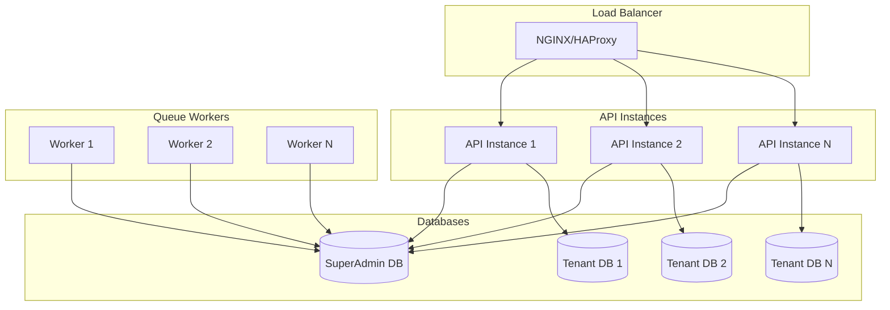

### Estrategias de Escalabilidad

1. **API Servers**: Múltiples instancias detrás de load balancer
2. **Queue Workers**: Workers distribuidos para procesar jobs
3. **Database Sharding**: Distribuir tenants en múltiples servidores de BD
4. **Read Replicas**: Replicas de lectura para reportes y analytics
5. **Caching**: Redis para cache de queries frecuentes

## Seguridad

### Capas de Seguridad

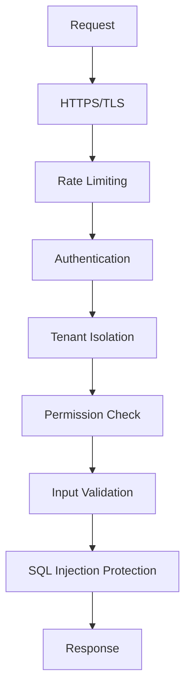

### Medidas de Seguridad Implementadas

1. **Autenticación**: JWT con refresh tokens
2. **Autorización**: RBAC con permisos granulares
3. **Aislamiento**: Base de datos por tenant
4. **Encriptación**: Contraseñas con bcrypt, datos sensibles encriptados
5. **Validación**: Validación de entrada con class-validator
6. **Rate Limiting**: Límites de requests por IP/usuario
7. **HTTPS**: Forzado en producción
8. **CORS**: Configuración restrictiva

## Monitoreo y Observabilidad

### Métricas Clave

- Tiempo de respuesta de API
- Tasa de errores
- Uso de recursos (CPU, memoria)
- Conexiones de base de datos activas
- Jobs de BullMQ procesados/fallidos
- Uso de almacenamiento por tenant

### Logging

- Logs estructurados con niveles (error, warn, info, debug)
- Contexto de tenant en todos los logs
- Trazabilidad de requests con request IDs
- Auditoría de acciones críticas

